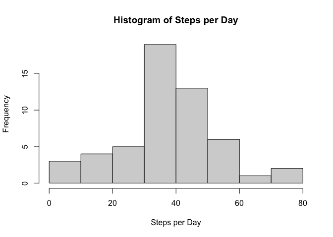
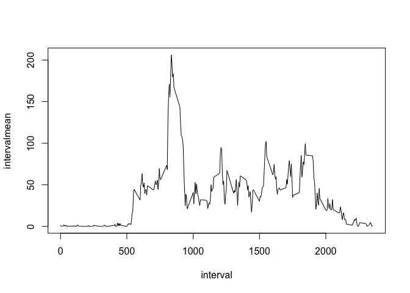
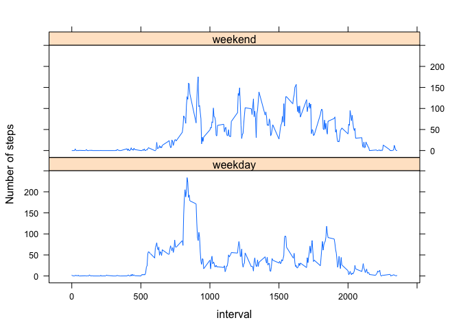

## Loading and preprocessing the data

```r
unzip("activity.zip")
data <- read.csv("activity.csv")
data$date <- as.Date(data$date, "%Y-%m-%d")
```


## What is mean total number of steps taken per day?

```r
stepsperday <- tapply(data$steps, data$date, sum, na.rm=TRUE)
hist(stepsperday,
     xlab = "Total Steps per Day", main = "Histogram of Total Steps per Day",
     breaks = 16)
```

<!-- -->

```r
mean(stepsperday)
```

```
## [1] 9354.23
```

```r
median(stepsperday)
```

```
## [1] 10395
```


## What is the average daily activity pattern?

```r
data$intervalmean <- tapply(data$steps, data$interval, mean, na.rm = TRUE)

with(data[order(data$interval),], plot(interval, intervalmean, type = "l"))
```

<!-- -->

```r
data$interval[which.max(data$intervalmean)]
```

```
## [1] 835
```


## Imputing missing values

Number of missing values (coded as NA):

```r
sum(is.na(data$steps))
```

```
## [1] 2304
```

Missing values will be replaced by the mean for that 5-minute interval:

```r
data$stepsimputed[is.na(data$steps)] <- data$intervalmean[is.na(data$steps)]
data$stepsimputed[!is.na(data$steps)] <- data$steps[!is.na(data$steps)]

stepsperdayimputed <- tapply(data$stepsimputed, data$date, sum)
hist(stepsperdayimputed,
     xlab = "Total Steps per Day", main = "Histogram of Total Steps per Day",
     breaks = 16)
```

<!-- -->

```r
mean(stepsperdayimputed)
```

```
## [1] 10766.19
```

```r
median(stepsperdayimputed)
```

```
## [1] 10766.19
```


## Are there differences in activity patterns between weekdays and weekends?

```r
data$daytype <- factor(ifelse(weekdays(data$date) == "Sunday" |
                                  weekdays(data$date) == "Saturday",
                              "weekend", "weekday"))

data$daytypeintervalmean[data$daytype=="weekday"] <-
    tapply(data$steps[data$daytype=="weekday"],
           data$interval[data$daytype=="weekday"],
           mean, na.rm = TRUE)

data$daytypeintervalmean[data$daytype=="weekend"] <-
    tapply(data$steps[data$daytype=="weekend"],
           data$interval[data$daytype=="weekend"],
           mean, na.rm = TRUE)

library(lattice)
xyplot(daytypeintervalmean ~ interval | daytype,
       data = data[order(data$interval),],
       layout = c(1, 2), type = "l", ylab = "Number of steps")
```

<!-- -->
